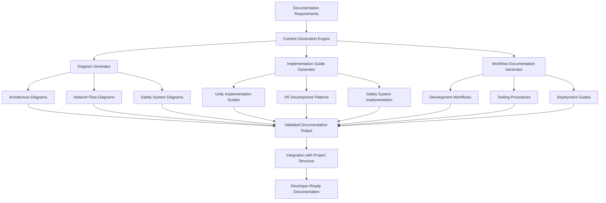

# Design Document

## Overview

The Implementation Documentation System is a comprehensive documentation generator that creates technical guides, architectural diagrams, and implementation patterns for the co-located multi-user VR system. This system will produce a complete set of Mermaid diagrams, Unity implementation guides, and development workflows that enable developers to efficiently build the VR solution defined in the README and steering documents.

The system is structured as a documentation generator that transforms high-level requirements into concrete, actionable technical documentation. It leverages the existing spec-workflow infrastructure and integrates with the established project structure to create a cohesive documentation ecosystem that bridges the gap between architectural vision and implementation reality.

## Steering Document Alignment

### Technical Standards (tech.md)
The design follows the technical standards established in tech.md by:

- **Unity 2022.3+ LTS Integration**: All documentation targets the specified Unity version with C# 9.0+ patterns
- **Meta Quest 3 Platform Focus**: Documentation specifically addresses Quest 3 capabilities including inside-out tracking and shared space features
- **XR Interaction Toolkit 2.5+ Usage**: Implementation guides build upon the established XR framework choice
- **Netcode for GameObjects 1.7+ Patterns**: Networking documentation follows the chosen multiplayer framework
- **Safety-First Architecture**: All documentation prioritizes collision prevention and user safety as the primary design constraint
- **Research Instrumentation**: Documentation includes built-in data collection patterns for academic research objectives

### Project Structure (structure.md)
The implementation follows project organization conventions by:

- **Documentation Directory Structure**: Creates organized docs/ hierarchy with diagrams/, guides/, and workflows/ subdirectories
- **C# Namespace Conventions**: All code examples follow MultiUserVR.* namespace patterns established in structure.md
- **Unity Asset Organization**: Implementation guides reference the established Assets/ structure with Scripts/, Prefabs/, and Materials/ organization
- **Modular Component Design**: Documentation promotes the established component-based architecture with clear module boundaries
- **Git Workflow Integration**: All documentation generation respects the established branch naming and commit message conventions

## Code Reuse Analysis

### Existing Components to Leverage
- **Spec-Workflow System**: Leverages existing approval workflows and template structures for documentation consistency
- **Mermaid Diagram Validation**: Integrates with existing diagram validation tools and preview systems
- **Project Structure Standards**: Builds upon established directory conventions and naming patterns
- **Unity Project Template**: Extends the existing VR template assets and XR Interaction Toolkit samples

### Integration Points
- **Existing Documentation System**: Integrates with the docs/ directory structure and README.md navigation
- **Unity Project Configuration**: Connects with existing ProjectSettings/ and Packages/ configurations
- **Version Control Integration**: Works with established .gitignore patterns and Git LFS configuration
- **Development Workflow**: Integrates with existing testing framework and build pipeline patterns

## Architecture

The system follows a modular documentation generation architecture that separates content creation, diagram generation, and validation concerns. The design emphasizes maintainability, extensibility, and alignment with the established project patterns.

### Modular Design Principles
- **Single File Responsibility**: Each documentation file addresses one specific technical domain (networking, VR, safety, etc.)
- **Component Isolation**: Separate generators for diagrams, implementation guides, and workflow documentation
- **Service Layer Separation**: Clear separation between content generation, template processing, and output formatting
- **Utility Modularity**: Focused utilities for diagram validation, code example generation, and documentation linking



## Components and Interfaces

### Architecture Diagram Generator
- **Purpose:** Creates comprehensive system architecture diagrams showing component relationships, data flow, and system boundaries
- **Interfaces:** generateSystemArchitecture(), generateComponentDiagram(), generateDataFlowDiagram()
- **Dependencies:** Mermaid validation system, project structure analysis, steering document content
- **Reuses:** Existing diagram validation tools, established component naming conventions

### VR Implementation Guide Generator
- **Purpose:** Produces Unity-specific implementation guides covering XR setup, avatar synchronization, and Quest 3 integration
- **Interfaces:** generateVRSetupGuide(), generateAvatarSyncGuide(), generateTrackingGuide()
- **Dependencies:** Unity project analysis, XR Interaction Toolkit documentation, Meta Quest SDK references
- **Reuses:** Unity project structure conventions, established C# coding patterns

### Safety System Documentation Generator
- **Purpose:** Creates comprehensive safety system documentation including collision detection algorithms and emergency protocols
- **Interfaces:** generateCollisionDetectionGuide(), generateSafetyProtocols(), generateEmergencyProcedures()
- **Dependencies:** Unity physics system documentation, safety requirement specifications
- **Reuses:** Established component isolation patterns, safety-first architecture principles

### Networking Architecture Documentation Generator
- **Purpose:** Produces detailed networking guides covering multi-user synchronization and Netcode for GameObjects patterns
- **Interfaces:** generateNetworkTopology(), generateSyncPatterns(), generateNetworkOptimization()
- **Dependencies:** Unity Netcode documentation, network performance requirements
- **Reuses:** Established networking namespace conventions, modular component design

### Workflow Documentation Generator
- **Purpose:** Creates development workflow documentation covering testing procedures, deployment strategies, and maintenance guides
- **Interfaces:** generateDevelopmentWorkflow(), generateTestingProcedures(), generateDeploymentGuide()
- **Dependencies:** Git workflow standards, Unity build pipeline configuration
- **Reuses:** Existing branch naming conventions, established testing framework patterns

### Research Documentation Generator
- **Purpose:** Produces research instrumentation guides covering data collection architecture and analysis pipelines
- **Interfaces:** generateDataCollectionGuide(), generateMetricsDocumentation(), generateAnalysisPipeline()
- **Dependencies:** Research requirements, data privacy considerations
- **Reuses:** Established research namespace conventions, modular data collection patterns

## Data Models

### Documentation Section
```csharp
public class DocumentationSection
{
    public string Id { get; set; }           // Unique identifier
    public string Title { get; set; }        // Section title
    public string Content { get; set; }      // Markdown content
    public List<string> DiagramIds { get; set; }  // Associated diagrams
    public List<string> Dependencies { get; set; } // Required prerequisites
    public DocumentationType Type { get; set; }    // Section type
    public DateTime LastUpdated { get; set; }      // Modification timestamp
}
```

### Diagram Definition
```csharp
public class DiagramDefinition
{
    public string Id { get; set; }           // Unique identifier
    public string Title { get; set; }        // Diagram title
    public string MermaidCode { get; set; }  // Mermaid diagram code
    public DiagramType Type { get; set; }    // Architecture, flow, sequence, etc.
    public List<string> Components { get; set; } // Referenced components
    public ValidationResult ValidationStatus { get; set; } // Validation state
    public DateTime LastValidated { get; set; }    // Last validation time
}
```

### Implementation Guide
```csharp
public class ImplementationGuide
{
    public string Id { get; set; }           // Unique identifier
    public string Title { get; set; }        // Guide title
    public string Overview { get; set; }     // High-level description
    public List<ImplementationStep> Steps { get; set; } // Step-by-step instructions
    public List<string> CodeExamples { get; set; }      // Code snippets
    public List<string> Prerequisites { get; set; }     // Required setup
    public TechnologyStack TargetStack { get; set; }    // Unity version, etc.
}
```

### Workflow Definition
```csharp
public class WorkflowDefinition
{
    public string Id { get; set; }           // Unique identifier
    public string Name { get; set; }         // Workflow name
    public string Description { get; set; }  // Workflow purpose
    public List<WorkflowStep> Steps { get; set; }       // Process steps
    public List<string> Tools { get; set; }             // Required tools
    public List<string> Deliverables { get; set; }      // Expected outputs
    public WorkflowType Type { get; set; }   // Development, testing, deployment
}
```

## Error Handling

### Error Scenarios
1. **Diagram Validation Failure**
   - **Handling:** Retry validation with corrected syntax, log specific syntax errors for manual review
   - **User Impact:** Clear error messages indicating which diagram sections need correction

2. **Missing Project Dependencies**
   - **Handling:** Check for required Unity packages and SDK versions, provide installation guidance
   - **User Impact:** Informative warnings with specific installation instructions

3. **Documentation Generation Timeout** 
   - **Handling:** Break large documentation into smaller chunks, implement progress tracking
   - **User Impact:** Progress indicators and partial completion status

4. **Template Processing Errors**
   - **Handling:** Fallback to default templates, validate template syntax before processing
   - **User Impact:** Warning messages with fallback indication, no documentation generation failure

5. **Integration Point Failures**
   - **Handling:** Graceful degradation when external systems unavailable, cache validation results
   - **User Impact:** Reduced functionality warnings, core documentation still generated

## Testing Strategy

### Unit Testing
- **Diagram Generation Testing:** Validate Mermaid syntax generation for all diagram types
- **Content Template Processing:** Test template variable substitution and content generation
- **Validation Logic Testing:** Verify diagram validation rules and error detection
- **Integration Point Testing:** Mock external dependencies and test error handling

### Integration Testing
- **Documentation Pipeline Testing:** End-to-end testing of requirements → documentation generation
- **Project Structure Integration:** Validate documentation placement in correct directory structure
- **Diagram Preview Integration:** Test integration with Mermaid preview and validation tools
- **Version Control Integration:** Verify generated documentation follows Git workflow patterns

### End-to-End Testing
- **Complete Documentation Generation:** Generate full documentation set and validate completeness
- **Developer Workflow Simulation:** Test documentation usage in realistic Unity development scenarios
- **Multi-Platform Validation:** Ensure documentation works across different development environments
- **Research Use Case Testing:** Validate research documentation meets academic requirements