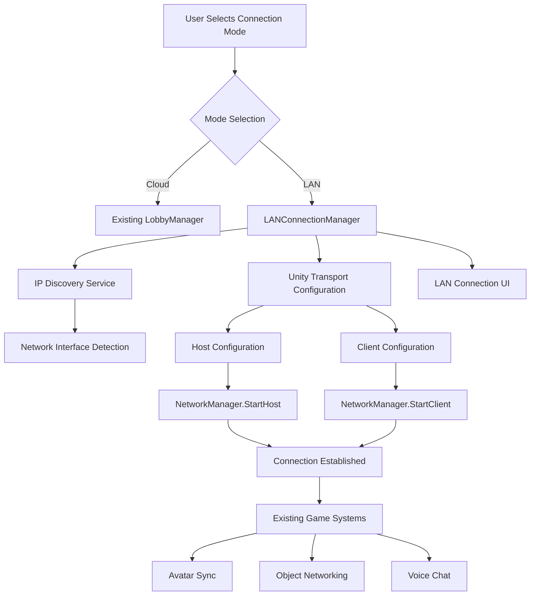

# Design Document

## Overview

The LAN Connection Manager is a networking component that provides direct IP-based connectivity for Unity Netcode for GameObjects (NGO) multiplayer sessions. It operates alongside the existing cloud-based UGS Lobby/Relay system, allowing users to choose between internet-based and local area network connection modes.

The component integrates with Unity's MR Multiplayer template architecture, specifically extending the NetworkManagerXRMultiplayer and XRINetworkGameManager components to support dual connection modes while maintaining compatibility with all existing networked features including avatar synchronization, object interaction, and voice chat.

## Steering Document Alignment

### Technical Standards (tech.md)

The design follows the established technology stack:
- **C# .NET Standard 2.1**: All components written in Unity-compatible C#
- **Netcode for GameObjects 2.x**: Direct integration with NGO's NetworkManager and Unity Transport
- **Event-driven Architecture**: Safety-first design where network events can be overridden by safety systems
- **Client-Server Model**: Maintains host authority for connection management and safety decisions
- **Component Principles**: Decoupled messaging between VR, network, and safety layers

### Project Structure (structure.md)

Implementation follows the established directory organization:
- **Scripts Location**: `Assets/Scripts/Networking/` for core LANConnectionManager
- **UI Components**: Integration with existing `Assets/MRTabletopAssets/Scripts/UI/LobbyList/` structure
- **Prefab Structure**: Extension of existing Network Manager prefab rather than replacement
- **Naming Conventions**: PascalCase for classes, following Unity template patterns

## Code Reuse Analysis

### Existing Components to Leverage

- **NetworkManagerXRMultiplayer**: Core network manager that will be extended to support transport mode switching
- **XRINetworkGameManager**: Primary game manager that orchestrates connection states
- **LobbyUI**: Existing UI structure will be extended with mode selection and IP entry components
- **UnityTransport**: Built-in Unity Transport component already configured on NetworkManager
- **PlayerListUI**: Connection status display will integrate with existing player management UI

### Integration Points

- **Network Manager Configuration**: Dynamic reconfiguration of UnityTransport connection data
- **UI System**: Extension of existing Canvas-based lobby UI with new panels and controls
- **Connection State Management**: Integration with existing NetworkManager state machine
- **Error Handling**: Reuse of existing error notification systems and user feedback mechanisms

## Architecture

The LAN Connection Manager employs a modular architecture with clear separation of concerns:

1. **Connection Mode Management**: Central coordinator for switching between Cloud and LAN modes
2. **IP Discovery Service**: Platform-specific network interface detection for Quest 3
3. **Connection Configuration**: Dynamic Unity Transport configuration management
4. **User Interface Layer**: Extended lobby UI with mode selection and IP entry
5. **Status Monitoring**: Real-time connection status reporting and error handling

### Modular Design Principles

- **Single File Responsibility**: LANConnectionManager handles only direct IP connections, separate from cloud logic
- **Component Isolation**: Network discovery, configuration, and UI are separate, focused components
- **Service Layer Separation**: Clear distinction between network services, UI controllers, and game logic
- **Utility Modularity**: IP validation, network interface detection, and connection helpers as separate utilities



## Components and Interfaces

### LANConnectionManager Component

- **Purpose:** Main coordinator for direct IP-based network connections
- **Interfaces:** 
  - `public void HostLAN(ushort port = 7777)`
  - `public void JoinLAN(string ipAddress, ushort port = 7777)`
  - `public string GetLocalIPAddress()`
  - `public bool IsLANModeActive { get; }`
- **Dependencies:** NetworkManagerXRMultiplayer, UnityTransport, IPDiscoveryService
- **Reuses:** Existing NetworkManager state management, transport configuration patterns

### IPDiscoveryService Utility

- **Purpose:** Detect and validate network interfaces for Quest 3 platform
- **Interfaces:**
  - `public static string GetLocalIPAddress()`
  - `public static bool ValidateIPAddress(string ip)`
  - `public static NetworkInterface GetWiFiInterface()`
- **Dependencies:** System.Net.NetworkInformation
- **Reuses:** Platform detection patterns from existing template components

### LANConnectionUI Component

- **Purpose:** User interface for connection mode selection and IP address entry
- **Interfaces:**
  - `public void OnModeChanged(ConnectionMode mode)`
  - `public void OnHostButtonClicked()`
  - `public void OnJoinButtonClicked()`
  - `public void UpdateConnectionStatus(ConnectionStatus status)`
- **Dependencies:** LANConnectionManager, existing UI framework
- **Reuses:** LobbyUI styling, notification systems, input validation patterns

### ConnectionModeManager Component

- **Purpose:** Central coordinator for switching between Cloud and LAN connection modes
- **Interfaces:**
  - `public void SetConnectionMode(ConnectionMode mode)`
  - `public ConnectionMode CurrentMode { get; }`
  - `public event System.Action<ConnectionMode> OnModeChanged`
- **Dependencies:** LANConnectionManager, LobbyManager
- **Reuses:** Existing state management patterns from XRINetworkGameManager

## Data Models

### ConnectionMode Enumeration

```csharp
public enum ConnectionMode
{
    Cloud,      // UGS Lobby/Relay mode (existing)
    LANDirect   // Direct IP connection mode (new)
}
```

### LANConnectionData Structure

```csharp
[System.Serializable]
public class LANConnectionData
{
    public string ipAddress;        // Target IP for client connections
    public ushort port;            // Network port (default 7777)
    public bool isHost;           // Whether this instance is hosting
    public ConnectionStatus status; // Current connection state
    public float connectionTimeout; // Timeout in seconds (default 5)
}
```

### ConnectionStatus Enumeration

```csharp
public enum ConnectionStatus
{
    Disconnected,
    Connecting,
    Connected,
    Failed,
    Timeout
}
```

## Error Handling

### Error Scenarios

1. **Network Interface Not Found**
   - **Handling:** Fall back to manual IP discovery instructions
   - **User Impact:** Display "Please check WiFi settings" with platform-specific steps

2. **Invalid IP Address Format**
   - **Handling:** Client-side validation before connection attempt
   - **User Impact:** Real-time validation feedback, red border on input field

3. **Connection Timeout**
   - **Handling:** 5-second timeout with automatic retry option
   - **User Impact:** Progress indicator with cancel option, clear retry button

4. **Host Unreachable**
   - **Handling:** Distinguish between network unreachable vs. host not responding
   - **User Impact:** Specific error messages like "Host not found" vs "Connection refused"

5. **Port Already In Use**
   - **Handling:** Attempt alternative ports (7778, 7779) or display error
   - **User Impact:** "Network port busy, trying alternative..." or manual port selection

## Unity Integration Patterns

### NetworkManager Extension Pattern

```csharp
public class LANConnectionManager : MonoBehaviour
{
    [Header("LAN Configuration")]
    [SerializeField] private ushort defaultPort = 7777;
    [SerializeField] private float connectionTimeout = 5.0f;
    
    private NetworkManagerXRMultiplayer networkManager;
    private UnityTransport transport;
    
    private void Awake()
    {
        networkManager = FindObjectOfType<NetworkManagerXRMultiplayer>();
        transport = networkManager.GetComponent<UnityTransport>();
    }
    
    public void HostLAN(ushort port = 7777)
    {
        ConfigureTransportForHost(port);
        networkManager.StartHost();
    }
    
    public void JoinLAN(string ipAddress, ushort port = 7777)
    {
        ConfigureTransportForClient(ipAddress, port);
        networkManager.StartClient();
    }
    
    private void ConfigureTransportForHost(ushort port)
    {
        transport.ConnectionData.Address = "0.0.0.0";
        transport.ConnectionData.Port = port;
        transport.ConnectionData.ServerListenAddress = "0.0.0.0";
    }
    
    private void ConfigureTransportForClient(string ipAddress, ushort port)
    {
        transport.ConnectionData.Address = ipAddress;
        transport.ConnectionData.Port = port;
    }
}
```

### UI Integration Pattern

```csharp
public class LANConnectionUI : MonoBehaviour
{
    [Header("UI References")]
    [SerializeField] private Toggle connectionModeToggle;
    [SerializeField] private TMP_InputField ipAddressInput;
    [SerializeField] private Button hostButton;
    [SerializeField] private Button joinButton;
    [SerializeField] private TextMeshProUGUI localIPDisplay;
    [SerializeField] private TextMeshProUGUI statusText;
    
    private LANConnectionManager lanManager;
    
    private void Start()
    {
        lanManager = FindObjectOfType<LANConnectionManager>();
        connectionModeToggle.onValueChanged.AddListener(OnConnectionModeToggled);
        hostButton.onClick.AddListener(OnHostButtonClicked);
        joinButton.onClick.AddListener(OnJoinButtonClicked);
        
        // Display local IP for hosting
        localIPDisplay.text = $"Your IP: {lanManager.GetLocalIPAddress()}";
    }
    
    private void OnConnectionModeToggled(bool isLANMode)
    {
        // Switch between cloud lobby UI and LAN direct UI
        ShowLANUI(isLANMode);
    }
    
    private void OnHostButtonClicked()
    {
        lanManager.HostLAN();
        UpdateStatus("Starting host...");
    }
    
    private void OnJoinButtonClicked()
    {
        if (IPDiscoveryService.ValidateIPAddress(ipAddressInput.text))
        {
            lanManager.JoinLAN(ipAddressInput.text);
            UpdateStatus("Connecting...");
        }
        else
        {
            UpdateStatus("Invalid IP address format");
        }
    }
}
```

### IP Discovery Implementation

```csharp
public static class IPDiscoveryService
{
    public static string GetLocalIPAddress()
    {
        try
        {
            foreach (NetworkInterface ni in NetworkInterface.GetAllNetworkInterfaces())
            {
                if (ni.NetworkInterfaceType == NetworkInterfaceType.Wireless80211 && 
                    ni.OperationalStatus == OperationalStatus.Up)
                {
                    foreach (UnicastIPAddressInformation ip in ni.GetIPProperties().UnicastAddresses)
                    {
                        if (ip.Address.AddressFamily == AddressFamily.InterNetwork && 
                            !IPAddress.IsLoopback(ip.Address))
                        {
                            return ip.Address.ToString();
                        }
                    }
                }
            }
        }
        catch (System.Exception ex)
        {
            Debug.LogError($"IP Discovery failed: {ex.Message}");
        }
        
        return "IP not found";
    }
    
    public static bool ValidateIPAddress(string ipString)
    {
        return IPAddress.TryParse(ipString, out IPAddress address) && 
               address.AddressFamily == AddressFamily.InterNetwork;
    }
}
```

## Testing Strategy

### Unit Testing

- **LANConnectionManager**: Mock NetworkManager and UnityTransport for isolated testing
- **IPDiscoveryService**: Test IP validation, network interface detection with mock interfaces
- **Connection State Management**: Verify state transitions and error handling paths

### Integration Testing

- **Unity Transport Configuration**: Verify correct transport settings for host/client modes
- **UI Integration**: Test mode switching, input validation, and status updates
- **NetworkManager Integration**: Ensure existing multiplayer features work with LAN connections

### End-to-End Testing

- **Device Testing**: Deploy to 3 Quest 3 devices, test LAN connections without internet
- **Network Scenarios**: Test various network configurations, firewall settings, and error conditions
- **Performance Testing**: Verify <20ms latency requirement, connection establishment timing

### Testing Tools and Approach

- **Unity Editor**: Multiplayer Play Mode and ParrelSync for initial development
- **Device Testing**: Quest 3 APK builds with dedicated WiFi network (isolated from internet)
- **Network Simulation**: Unity Network Simulator for latency and packet loss testing
- **Performance Monitoring**: Unity Profiler and NGO debugging tools for latency measurement

## Platform-Specific Considerations

### Meta Quest 3 Networking

- **Network Interface Priority**: WiFi interfaces take precedence over mobile data
- **System Networking**: Use Android-compatible NetworkInformation APIs
- **Platform Detection**: Conditional compilation for Quest-specific network discovery
- **Performance**: Optimize for Quest 3's ARM64 architecture and limited processing power

### Unity Transport Configuration

- **Connection Data Structure**: Proper initialization of ConnectionData for both host and client modes
- **Transport Switching**: Runtime reconfiguration without requiring NetworkManager restart
- **Error Handling**: Platform-specific error codes and recovery strategies
- **Security**: Leverage Unity Transport's built-in encryption capabilities where available