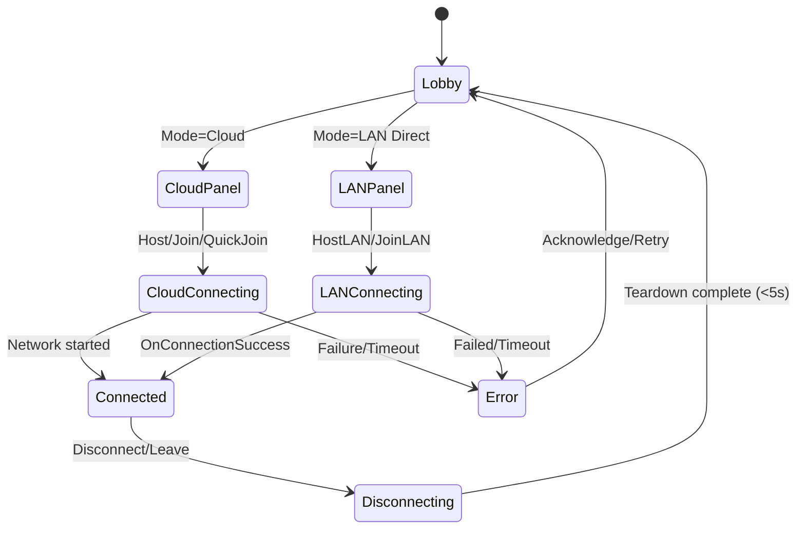

# Design Document

## Overview

Session Management UI provides a dual-mode multiplayer control surface that allows switching between Cloud (UGS Lobby/Relay) and LAN Direct (Unity Transport) without restarting the scene. It unifies Host/Join/Leave/Disconnect, status and error feedback, and player listing while delegating network actions to XRINetworkGameManager (cloud) or LANConnectionManager (LAN).

## Steering Document Alignment

### Technical Standards (tech.md)
- Event-driven architecture: UI subscribes to manager events (BindableVariables and C# events) and updates reactively.
- NGO 2.x + Unity Transport: Reuse NetworkManagerXRMultiplayer and UnityTransport; keep cloud optional via Lobby/Relay.
- Performance: 5s connect/disconnect target, minimal allocations (pool UI items, reuse TMP components), no GC spikes during transitions.

### Project Structure (structure.md)
- UI scripts under MRTabletopAssets/Scripts/UI (LobbyList, LAN/…)
- Network managers under XRMP/Scripts/Network/NetworkManagers
- Keep template-prefab flow intact; add LAN panel and mode switch into existing Lobby UI panel set.

## Code Reuse Analysis

### Existing Components to Leverage
- LobbyUI.cs: central lobby controls; add mode toggle and panel switching (already integrated).
- XRINetworkGameManager.cs: high-level connection state, cloud flows, and LAN integration handlers.
- ConnectionModeManager.cs: orchestrates mode switching, disconnects, availability checks.
- LANConnectionManager.cs: direct IP host/join, timeout, events; configures UnityTransport.
- NetworkManagerXRMultiplayer.cs: template NetworkManager wrapper.
- PlayerListUI.cs: existing player list and role badges (Host/Client) rendering.

### Integration Points
- Cloud mode: AuthenticationManager + LobbyManager + Relay via XRINetworkGameManager.
- LAN mode: UnityTransport configured directly via LANConnectionManager; no UGS.
- UI: LobbyUI toggles sub-panels; LANConnectionUI provides IP entry and button handlers.

## Architecture

- Single UI surface with sub-panels switched by LobbyUI.ToggleConnectionSubPanel.
- ConnectionModeManager mediates mode changes, ensuring clean disconnect before switching.
- XRINetworkGameManager reflects connection state via BindableVariables; propagates LAN events.
- LANConnectionManager exposes status and result events; enforces 5s timeout.

### UI State Machine



## Components and Interfaces

### ConnectionModeManager
- Purpose: Centralize mode switching; ensure disconnect before switching; expose events.
- Interfaces:
  - SetConnectionMode(ConnectionMode mode, bool forceSwitch = false)
  - Disconnect() (mode-agnostic)
  - Events: OnModeChanged, OnModeSwitchStarted/Completed/Failed
- Dependencies: XRINetworkGameManager, LobbyManager (Cloud), LANConnectionManager (LAN)

### XRINetworkGameManager
- Purpose: High-level session flow; exposes bindable connection state and status; owns cloud path; handles LAN event bridging.
- Key members:
  - Bindables: CurrentConnectionState, Connected, ConnectedRoomName
  - Methods (Cloud): QuickJoinLobby, JoinLobbyByCode, JoinLobbySpecific, CreateNewLobby, CancelMatchmaking
  - Methods (Both): Disconnect(), DisconnectAsync()
  - Events: connectionUpdated(string), connectionFailedAction(string)

### LANConnectionManager
- Purpose: Direct LAN host/join via UnityTransport, with 5s timeout and status events.
- Methods: HostLAN(ushort port = 7777), JoinLAN(string ip, ushort port = 7777), Disconnect()
- Events: OnStatusChanged(LANConnectionStatus), OnConnectionFailed(string), OnConnectionSuccess()
- Properties: LocalIPAddress, IsHosting, Status

### LobbyUI
- Purpose: Master UI for session management; selects mode, exposes cloud flows, routes to panels.
- Key hooks:
  - OnConnectionModeToggleChanged(bool isLANMode)
  - UpdateUIForConnectionMode() to swap panels
  - Cloud actions (CreateLobby, EnterRoomCode, JoinLobby, QuickJoin)

### LANConnectionUI
- Purpose: LAN-specific UI: IP entry, Host/Join buttons, prominent Disconnect while connected.
- Key hooks:
  - OnHostButtonClicked(), OnJoinButtonClicked(), OnDisconnectButtonClicked()
  - Real-time IP validation feedback
  - Shows Local IP when hosting

## Data Models

- ConnectionMode: Cloud | LANDirect (ConnectionModeManager.ConnectionMode)
- LANConnectionStatus: Disconnected | Connecting | Connected | Failed | Timeout

## Error Handling

- UGS failure (auth/lobby/relay): Show concise error, allow retry or switch to LAN; ConnectionModeManager may suggest LAN.
- LAN failure (invalid IP/timeout/port in use): Show error; reset to Authenticated/Ready; keep LAN panel visible for retry.
- Timeout (5s): Both paths enforce timeout and surface user-visible error.

## Testing Strategy

- PlayMode tests: Assets/Tests/PlayMode/Network/LANIntegrationTests.cs (host start, client connect, transport config).
- Manual-Editor: ParrelSync or Multiplayer Play Mode; verify UI states and transitions under 5s.
- Device: 2–3 Quest 3 on Wi‑Fi with no internet for LAN; verify connect/disconnect latency and stability.
- Performance: Profile allocations during connect/disconnect, ensure no GC spikes; pool UI items.

## Code Examples

Mode toggle from LobbyUI:

```csharp
// Switches between Cloud and LAN modes based on toggle
```

```csharp path=C:\github\multi-user-vr\mr-multiplayer\Assets\MRTabletopAssets\Scripts\UI\LobbyList\LobbyUI.cs start=141
/// <summary>
/// Called when connection mode toggle is changed by user.
/// </summary>
/// <param name="isLANMode">True if LAN mode is selected, false for Cloud mode</param>
private void OnConnectionModeToggleChanged(bool isLANMode)
{
    if (m_ConnectionModeManager == null)
    {
        Debug.LogWarning("[LobbyUI] Cannot switch mode: ConnectionModeManager not available.");
        return;
    }

    ConnectionModeManager.ConnectionMode newMode = isLANMode 
        ? ConnectionModeManager.ConnectionMode.LANDirect 
        : ConnectionModeManager.ConnectionMode.Cloud;

    // Only switch if different from current mode
    if (newMode != m_CurrentMode)
    {
        m_ConnectionModeManager.SetConnectionMode(newMode);
    }
}
```

LAN button handlers in LANConnectionUI:

```csharp path=C:\github\multi-user-vr\mr-multiplayer\Assets\MRTabletopAssets\Scripts\UI\LAN\LANConnectionUI.cs start=316
/// <summary>
/// Called when Host button is clicked.
/// </summary>
private void OnHostButtonClicked()
{
    Debug.Log("[LANConnectionUI] Host button clicked");
    if (m_LANConnectionManager == null)
    {
        UpdateConnectionStatus("LAN Connection Manager not available", m_ErrorColor);
        return;
    }
    if (m_CurrentMode != ConnectionModeManager.ConnectionMode.LANDirect)
    {
        UpdateConnectionStatus("Please switch to LAN Direct mode first", m_WarningColor);
        return;
    }
    UpdateConnectionStatus("Starting host...", m_InfoColor);
    ShowLoadingIndicator(true);
    m_LANConnectionManager.HostLAN(m_DefaultPort);
}
```

```csharp path=C:\github\multi-user-vr\mr-multiplayer\Assets\MRTabletopAssets\Scripts\UI\LAN\LANConnectionUI.cs start=342
/// <summary>
/// Called when Join button is clicked.
/// </summary>
private void OnJoinButtonClicked()
{
    Debug.Log("[LANConnectionUI] Join button clicked");
    if (m_LANConnectionManager == null)
    {
        UpdateConnectionStatus("LAN Connection Manager not available", m_ErrorColor);
        return;
    }
    if (m_CurrentMode != ConnectionModeManager.ConnectionMode.LANDirect)
    {
        UpdateConnectionStatus("Please switch to LAN Direct mode first", m_WarningColor);
        return;
    }
    if (string.IsNullOrEmpty(m_CurrentIPInput))
    {
        UpdateConnectionStatus("Please enter a host IP address", m_WarningColor);
        return;
    }
    if (!m_LANConnectionManager.ValidateIPAddress(m_CurrentIPInput))
    {
        UpdateConnectionStatus("Invalid IP address format", m_ErrorColor);
        return;
    }
    UpdateConnectionStatus($"Connecting to {m_CurrentIPInput}...", m_InfoColor);
    ShowLoadingIndicator(true);
    m_LANConnectionManager.JoinLAN(m_CurrentIPInput, m_DefaultPort);
}
```

Status updates from XRINetworkGameManager (LAN path):

```csharp path=C:\github\multi-user-vr\mr-multiplayer\Assets\XRMP\Scripts\Network\NetworkManagers\XRINetworkGameManager.cs start=382
/// <summary>
/// Called when LAN connection status changes.
/// </summary>
void OnLANStatusChanged(LANConnectionManager.LANConnectionStatus status)
{
    Utils.Log($"{k_DebugPrepend}LAN status changed to: {status}");
    switch (status)
    {
        case LANConnectionManager.LANConnectionStatus.Connecting:
            m_ConnectionState.Value = ConnectionState.Connecting;
            ConnectionUpdated("Connecting via LAN...");
            break;
        case LANConnectionManager.LANConnectionStatus.Connected:
            m_ConnectionState.Value = ConnectionState.Connected;
            ConnectionUpdated("Connected via LAN");
            break;
        case LANConnectionManager.LANConnectionStatus.Disconnected:
            m_ConnectionState.Value = ConnectionState.Authenticated;
            ConnectionUpdated("Disconnected from LAN");
            break;
        case LANConnectionManager.LANConnectionStatus.Failed:
        case LANConnectionManager.LANConnectionStatus.Timeout:
            m_ConnectionState.Value = ConnectionState.Authenticated;
            break;
    }
}
```
