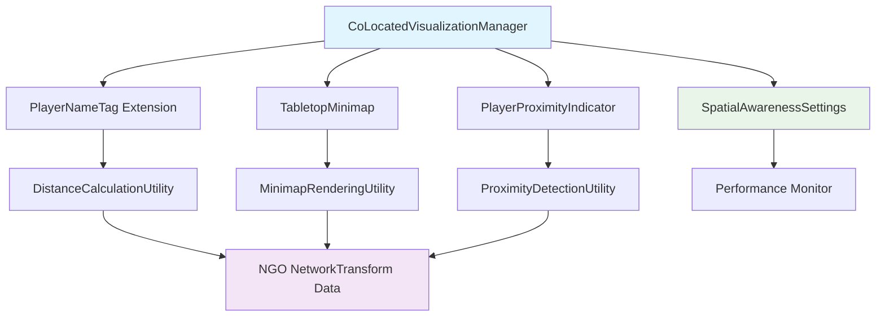

# Design Document

## Overview

The Spatial Awareness System extends the existing Unity MR Multiplayer template foundation to provide real-time distance indicators, tabletop minimap visualization, and proximity warnings for co-located Quest 3 users. The design leverages existing PlayerNameTag.cs LOD system, Unity's XR Interaction Toolkit, and Netcode for GameObjects while maintaining 90 FPS performance through efficient spatial calculations and modular architecture.

## Steering Document Alignment

### Technical Standards (tech.md)

- **Event-driven Architecture**: Follows the established pattern with VR Input → Networking → Safety → Game Logic → Research layers
- **Safety-first Principle**: Spatial awareness components can override other systems when proximity thresholds are breached
- **Client-server Model**: Leverages NGO's host authority for proximity decisions while keeping distance calculations local
- **Unity Services Integration**: Uses existing NGO NetworkTransform data without additional network overhead

### Project Structure (structure.md)

- **Component Organization**: New scripts follow established `/Scripts/{Domain}/` pattern with LocalPlayer, Network, and Safety domains
- **Prefab Conventions**: Extends existing XRI_Network_Player_Avatar pattern with additional UI components
- **Asset Management**: Minimap assets integrate with MRTabletopAssets hierarchy for consistent tabletop anchoring

## Code Reuse Analysis

### Existing Components to Leverage

- **PlayerNameTag.cs**: Extends existing LOD system (m_MaxDistanceThreshold, m_MinDistanceThreshold) to add distance display functionality
- **XRINetworkPlayer.cs**: Uses existing player color system (playerColor) for consistent minimap icon coloring
- **WorldCanvas.cs**: Reuses existing world-space UI patterns for distance indicator rendering
- **NGO NetworkTransform**: Leverages existing position synchronization without additional networking code

### Integration Points

- **Unity XR Interaction Toolkit**: Integrates with existing controller interaction patterns for settings toggles
- **Netcode for GameObjects**: Uses NetworkVariables from existing player objects for spatial data access
- **MRTabletopAssets Virtual Table**: Anchors minimap to existing tabletop GameObject for consistent spatial reference
- **Unity Physics**: Utilizes existing collision detection systems for proximity calculations

## Architecture

The spatial awareness system follows a layered architecture that integrates seamlessly with existing Unity MR Multiplayer patterns:

### Modular Design Principles

- **Single File Responsibility**: PlayerNameTag extension handles only distance display; TabletopMinimap manages only map rendering; PlayerProximityIndicator focuses solely on warnings
- **Component Isolation**: Each awareness feature can be enabled/disabled independently through CoLocatedVisualizationManager
- **Service Layer Separation**: Spatial calculations isolated in utility classes; UI rendering separated from data processing; settings management centralized
- **Utility Modularity**: Distance calculation, proximity detection, and performance monitoring split into focused utility classes



## Components and Interfaces

### CoLocatedVisualizationManager

- **Purpose:** Centralized coordinator for all spatial awareness features with performance monitoring
- **Interfaces:** 
  - `EnableDistanceIndicators(bool enabled)`
  - `EnableMinimap(bool enabled)`
  - `EnableProximityWarnings(bool enabled)`
  - `GetPerformanceMetrics() : SpatialPerformanceData`
- **Dependencies:** All spatial awareness components, Unity Profiler API
- **Reuses:** Existing Unity singleton patterns, NGO network lifecycle events

### PlayerNameTag (Extended)

- **Purpose:** Adds distance display to existing name tag LOD system without disrupting current functionality
- **Interfaces:**
  - `SetDistanceDisplayEnabled(bool enabled)`
  - `UpdateDistanceDisplay(float distance, Color colorCode)`
- **Dependencies:** Existing PlayerNameTag.cs, DistanceCalculationUtility
- **Reuses:** Current LOD thresholds (m_MaxDistanceThreshold), existing UI text components, color coding system

### TabletopMinimap

- **Purpose:** Renders orthographic top-down view of player positions anchored to Virtual Table GameObject
- **Interfaces:**
  - `SetMinimapEnabled(bool enabled)`
  - `SetZoomLevel(float zoomMultiplier)`
  - `UpdatePlayerPositions(PlayerPositionData[] positions)`
- **Dependencies:** MinimapRenderingUtility, Unity Camera system, MRTabletopAssets
- **Reuses:** Existing player color system, Unity Canvas components, tabletop anchoring patterns

### PlayerProximityIndicator

- **Purpose:** Detects close proximity between players and triggers gentle audio/visual warnings
- **Interfaces:**
  - `SetWarningThreshold(float meters)`
  - `EnableHapticFeedback(bool enabled)`
  - `TriggerProximityWarning(ProximityWarningData warningData)`
- **Dependencies:** ProximityDetectionUtility, Unity AudioSource, XR Controller haptics
- **Reuses:** Existing Unity audio system, XRI haptic patterns, UI overlay components

### DistanceCalculationUtility

- **Purpose:** Efficient distance calculations between players with 10Hz update limiting
- **Interfaces:**
  - `CalculateDistance(Transform playerA, Transform playerB) : float`
  - `GetColorCodeForDistance(float distance) : Color`
  - `ShouldUpdateDistance() : bool` (handles 10Hz limiting)
- **Dependencies:** Unity Transform system, Time utility
- **Reuses:** Existing Vector3.Distance patterns, color management utilities

## Data Models

### SpatialAwarenessSettings

```csharp
[CreateAssetMenu(fileName = "SpatialAwarenessSettings", menuName = "XR Multiplayer/Spatial Awareness Settings")]
public class SpatialAwarenessSettings : ScriptableObject
{
    [Header("Distance Indicators")]
    public bool distanceIndicatorsEnabled = true;
    public float updateFrequencyHz = 10f;
    public Color greenDistanceColor = Color.green;    // >2m
    public Color yellowDistanceColor = Color.yellow;  // 1-2m  
    public Color redDistanceColor = Color.red;        // <1m

    [Header("Minimap")]
    public bool minimapEnabled = false;
    public float defaultZoomLevel = 1f;
    public Vector2 minimapSize = new Vector2(200, 200);

    [Header("Proximity Warnings")]
    public bool proximityWarningsEnabled = true;
    public float warningThreshold = 1f;
    public float hysteresisThreshold = 1.2f;
    public bool hapticFeedbackEnabled = true;
    public AudioClip warningSound;
}
```

### PlayerPositionData

```csharp
public struct PlayerPositionData
{
    public ulong playerId;
    public Vector3 worldPosition;
    public Color playerColor;
    public bool isLocalPlayer;
    public float lastUpdateTime;
}
```

### SpatialPerformanceData

```csharp
public struct SpatialPerformanceData
{
    public float averageFrameRate;
    public float distanceCalculationTime;
    public float minimapRenderTime;
    public int activeComponents;
    public bool performanceWarning;
}
```

## Error Handling

### Error Scenarios

1. **Network Disconnection During Spatial Updates**
   - **Handling:** Use last-known positions with gradual fade-out, disable proximity warnings for disconnected players
   - **User Impact:** Distance indicators show "Lost" state, warnings don't false-trigger for disconnected players

2. **Performance Degradation Below 85 FPS**
   - **Handling:** Automatically disable least critical features (minimap first, then distance indicators), keep proximity warnings active
   - **User Impact:** Settings UI shows performance mode active, features can be manually re-enabled

3. **Minimap Rendering Failures**
   - **Handling:** Graceful degradation to distance indicators only, log errors for debugging
   - **User Impact:** Notification that minimap is unavailable, other spatial features continue functioning

4. **Proximity Detection False Positives from Tracking Noise**
   - **Handling:** Implement sustained proximity requirement (200ms minimum), hysteresis thresholds
   - **User Impact:** Warnings only trigger for actual close approaches, not brief tracking glitches

## Testing Strategy

### Unit Testing

- **Distance Calculation Accuracy**: Test DistanceCalculationUtility with known Transform positions
- **Performance Limiting**: Verify 10Hz update frequency compliance under various load conditions
- **Color Coding Logic**: Test distance-to-color mapping with edge cases (exactly 1m, 2m thresholds)
- **Settings Persistence**: Verify ScriptableObject settings load/save correctly across sessions

### Integration Testing

- **PlayerNameTag Extension**: Test distance display integration without breaking existing LOD functionality
- **NGO Data Integration**: Verify spatial calculations work correctly with NetworkTransform updates
- **Minimap Anchoring**: Test tabletop anchoring with various Virtual Table positions and rotations
- **Multi-player Scenarios**: Test 3-player interactions with various proximity combinations

### End-to-End Testing

- **Co-located Safety Scenario**: Test complete proximity warning flow when two users approach <1m
- **Performance Stress Testing**: Run all spatial features simultaneously while maintaining 90 FPS on Quest 3
- **User Experience Flow**: Test complete enable/disable flow for each spatial awareness feature
- **Network Resilience**: Test spatial system behavior during connection drops and reconnections