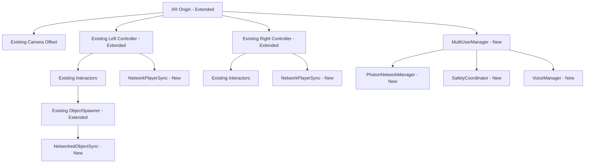

# Design Document

## Overview

The Unity MVP Implementation builds directly on the existing Unity template structure in the co-located-vr project, extending the XR Interaction Toolkit foundation with multi-user networking capabilities. This design leverages the pre-configured XR Origin (XR Rig), existing interactor systems, and MRTemplateAssets patterns while adding minimal networking and safety components required for 3-user collaboration.

The system extends rather than replaces Unity's template, ensuring compatibility with future Unity updates and maintaining the established component architecture. All additions follow the `Unity.XRTemplate` namespace conventions and build on proven MonoBehaviour patterns.

## Steering Document Alignment

### Technical Standards (tech.md)
Following the established technology constraints while building on Unity's template:
- **Unity 2022.3 LTS**: Extending existing XR Origin prefab with networking components
- **Meta XR SDK**: Building on configured Quest 3 integration in Assets/XR/Settings/
- **Photon Fusion2**: Adding as new dependency for multi-user functionality
- **XR Interaction Toolkit**: Extending existing interactors for networked object manipulation
- **MRTemplateAssets patterns**: Following Unity.XRTemplate namespace and component organization

### Project Structure (structure.md)
Extending the established Unity template organization:
- Scripts in Unity.XRTemplate namespace under Assets/MRTemplateAssets/Scripts/
- Extensions to existing XR Origin prefab rather than new prefabs
- Integration with existing Samples/XR Interaction Toolkit structure
- Building on MRTemplateAssets component patterns and UnityEvent systems

## Code Reuse Analysis

### Existing Components to Leverage
- **XR Origin (XR Rig) Prefab**: Base for multi-user VR setup with pre-configured controllers and interactors
- **ObjectSpawner & SpawnedObjectsManager**: Extending for networked object synchronization
- **XR Interaction Toolkit Interactors**: Ray, Poke, Near-Far interactors for multi-user object manipulation
- **ControllerInputActionManager**: Input handling patterns for additional networking controls
- **Unity.XRTemplate namespace**: Following established component and script organization patterns

### Integration Points
- **Existing XR Origin**: Adding NetworkBehaviour components to the prefab hierarchy
- **MRTemplateAssets Scripts**: Extending with MultiUserManager following established patterns
- **Object Spawning System**: Enhancing existing ObjectSpawner with network synchronization
- **Controller Components**: Adding network data sharing to existing controller management
- **Permission System**: Building on existing PermissionsCheck patterns for multi-user setup

## Architecture

The system extends Unity's template through component composition, adding networking capabilities to the existing XR Origin structure without breaking the established patterns. This approach maintains compatibility and follows Unity's intended usage patterns.

### Modular Design Principles
- **Template Extension**: Adding components to existing prefabs rather than replacing them
- **Namespace Consistency**: All new scripts use Unity.XRTemplate namespace
- **Component Composition**: Adding NetworkBehaviour scripts alongside existing MonoBehaviours
- **Event Integration**: Using UnityEvents to integrate with existing MRTemplateAssets patterns



## Components and Interfaces

### MultiUserManager (extends MRTemplateAssets patterns)
- **Purpose:** Central coordinator extending Unity template patterns for 3-user sessions
- **Interfaces:** StartSession(), JoinSession(), LeaveSession(), GetConnectedUsers()
- **Dependencies:** PhotonNetworkManager, SafetyCoordinator, existing XR Origin
- **Reuses:** UnityEvent patterns from MRTemplateAssets, MonoBehaviour lifecycle
- **Namespace:** Unity.XRTemplate

### NetworkPlayerSync (extends existing controllers)
- **Purpose:** Add network synchronization to existing Left/Right Controller components
- **Interfaces:** SyncTransform(), SyncControllerInput(), HandleNetworkUpdate()
- **Dependencies:** Photon NetworkBehaviour, existing ControllerInputActionManager
- **Reuses:** Existing controller hierarchy and input action systems
- **Integration:** Attached as additional component to existing controller GameObjects

### SafetyCoordinator (follows MRTemplateAssets patterns)
- **Purpose:** Multi-user collision prevention using Unity physics and guardian integration
- **Interfaces:** MonitorProximity(), TriggerSafetyWarning(), HandleEmergencyStop()
- **Dependencies:** Unity Physics, Quest guardian system, MultiUserManager
- **Reuses:** Unity Collider/Rigidbody systems, UnityEvent notification patterns
- **Integration:** Extends existing safety patterns from MRTemplateAssets

### NetworkedObjectSpawner (extends existing ObjectSpawner)
- **Purpose:** Add network synchronization to existing SpawnedObjectsManager system
- **Interfaces:** NetworkSpawn(), SyncObjectState(), HandleOwnershipTransfer()
- **Dependencies:** Existing ObjectSpawner, SpawnedObjectsManager, Photon networking
- **Reuses:** Existing spawning logic, object pooling, and TMP_Dropdown UI patterns
- **Integration:** Enhances existing spawning workflow with network capability

### PhotonNetworkManager (new component following template patterns)
- **Purpose:** Photon Fusion2 integration following Unity template component structure
- **Interfaces:** ConnectToRoom(), HandlePlayerJoined(), SyncSessionData()
- **Dependencies:** Photon Fusion2 SDK, Unity networking patterns
- **Reuses:** MonoBehaviour patterns, UnityEvent integration from template
- **Integration:** Singleton following MRTemplateAssets organizational patterns

### VoiceManager (follows template event patterns)
- **Purpose:** Spatial voice communication using Unity Audio and Photon Voice
- **Interfaces:** InitializeVoice(), UpdateSpatialAudio(), HandleMuteToggle()
- **Dependencies:** Unity AudioSource/AudioListener, Photon Voice, existing audio setup
- **Reuses:** Unity Audio system, event-driven patterns from MRTemplateAssets
- **Integration:** Extends existing audio configuration in XR Origin

## Data Models

### NetworkPlayerData (INetworkSerializable)
```csharp
namespace Unity.XRTemplate
{
    [System.Serializable]
    public struct NetworkPlayerData : INetworkSerializable
    {
        public Vector3 HeadPosition;
        public Quaternion HeadRotation;
        public Vector3 LeftHandPosition;
        public Quaternion LeftHandRotation;
        public Vector3 RightHandPosition;
        public Quaternion RightHandRotation;
        public bool IsTracking;
        public NetworkString<16> PlayerName;
        
        public void NetworkSerialize<T>(BufferSerializer<T> serializer) where T : IReaderWriter
        {
            serializer.SerializeValue(ref HeadPosition);
            serializer.SerializeValue(ref HeadRotation);
            serializer.SerializeValue(ref LeftHandPosition);
            serializer.SerializeValue(ref LeftHandRotation);
            serializer.SerializeValue(ref RightHandPosition);
            serializer.SerializeValue(ref RightHandRotation);
            serializer.SerializeValue(ref IsTracking);
            serializer.SerializeValue(ref PlayerName);
        }
    }
}
```

### SafetyEventData (following UnityEvent patterns)
```csharp
namespace Unity.XRTemplate
{
    [System.Serializable]
    public class SafetyEventData
    {
        public float ProximityWarningLevel; // 0.0 to 1.0
        public bool[] BoundaryViolations; // Array for 3 users
        public Vector3[] LastKnownPositions;
        public bool EmergencyStopTriggered;
    }
    
    [System.Serializable]
    public class SafetyEvent : UnityEvent<SafetyEventData> { }
}
```

### NetworkSessionData (session state management)
```csharp
namespace Unity.XRTemplate
{
    [System.Serializable]
    public struct NetworkSessionData : INetworkSerializable
    {
        public NetworkString<32> RoomId;
        public int ConnectedPlayerCount;
        public float SessionStartTime;
        public bool SessionActive;
        
        public void NetworkSerialize<T>(BufferSerializer<T> serializer) where T : IReaderWriter
        {
            serializer.SerializeValue(ref RoomId);
            serializer.SerializeValue(ref ConnectedPlayerCount);
            serializer.SerializeValue(ref SessionStartTime);
            serializer.SerializeValue(ref SessionActive);
        }
    }
}
```

## Error Handling

### Error Scenarios

1. **Network Connection Issues:**
   - **Handling:** Follow existing MRTemplateAssets error patterns with UnityEvents for notification
   - **User Impact:** Visual indicators using existing UI patterns, graceful degradation to offline mode

2. **Tracking System Problems:**
   - **Handling:** Build on existing XR tracking recovery, extend with multi-user coordination
   - **User Impact:** Maintain existing single-user experience, add network sync when tracking recovers

3. **Controller Disconnection:**
   - **Handling:** Leverage existing ControllerInputActionManager error handling, add network notification
   - **User Impact:** Existing controller reconnection flow plus network state synchronization

4. **Object Spawning Conflicts:**
   - **Handling:** Extend existing ObjectSpawner error handling with network conflict resolution
   - **User Impact:** Maintain existing spawning UX with network authority management

## Testing Strategy

### Unit Testing
- **Template Extension Testing:** Verify new components don't break existing XR Origin functionality
- **Network Component Testing:** Test NetworkBehaviour components in isolation
- **Safety System Testing:** Validate safety components using Unity Physics test framework

### Integration Testing  
- **XR Origin Enhancement:** Test extended XR Origin prefab with networking components
- **Object Spawning Network Sync:** Validate enhanced ObjectSpawner with multiple users
- **Controller Network Sync:** Test extended controller components with network synchronization

### End-to-End Testing
- **3-User Template Sessions:** Full testing using extended Unity template with all users
- **Template Compatibility:** Ensure compatibility with Unity template updates and XR Toolkit updates
- **Performance Validation:** Maintain existing template performance with networking additions

### Template Validation Testing
- **Unity Template Integrity:** Ensure extensions don't modify core template behavior
- **XR Interaction Toolkit Compatibility:** Validate with XRI sample scenes and functionality
- **Future Update Compatibility:** Test upgrade path for Unity template and XRI updates