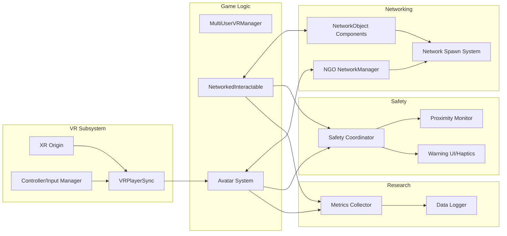
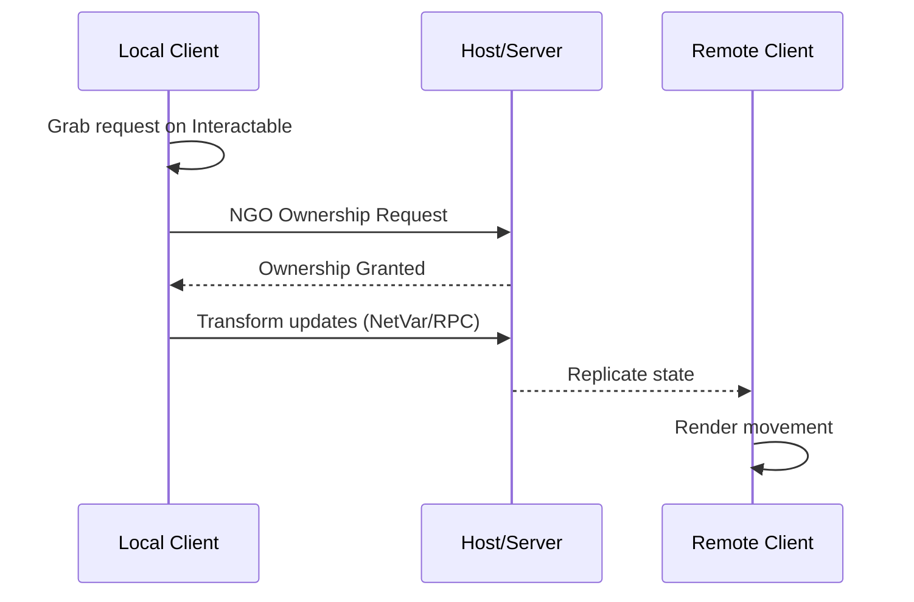

[← Documentation Home](../README.md) · [← Architecture](README.md)

# Component Relationships

Readable component-level interactions grouped by responsibility (Requirements 1.1). Diagrams are split to avoid excessive complexity.

## Core Runtime Components

## Ownership and Authority (Object Interaction)

