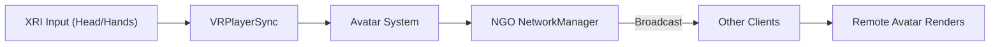
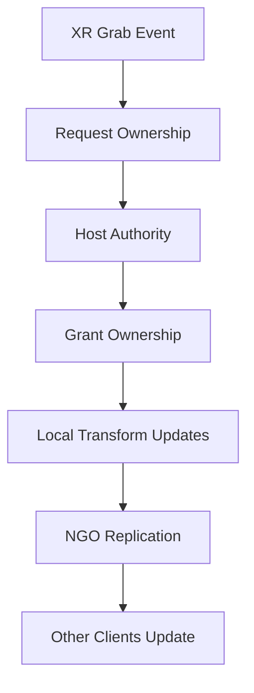
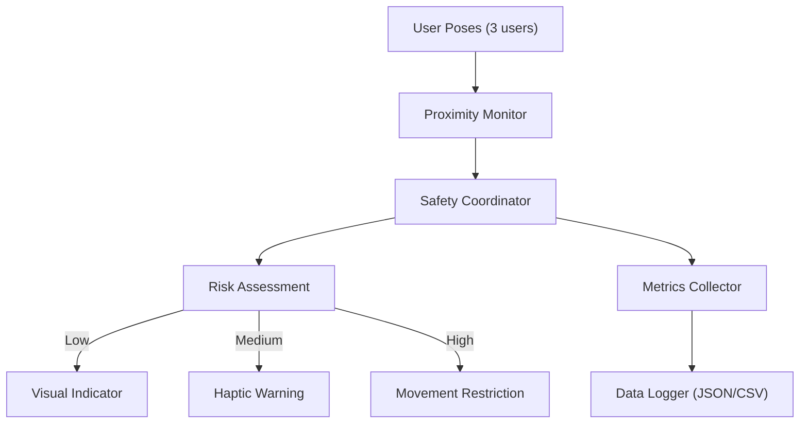

[← Documentation Home](../README.md) · [← Architecture](README.md)

# Data Flow Diagrams

Focused data flows for tracking, interaction, and safety pipelines. Diagrams are intentionally modular for readability.

## Head/Hand Tracking Synchronization

## Networked Object Interaction

## Safety Event Pipeline

