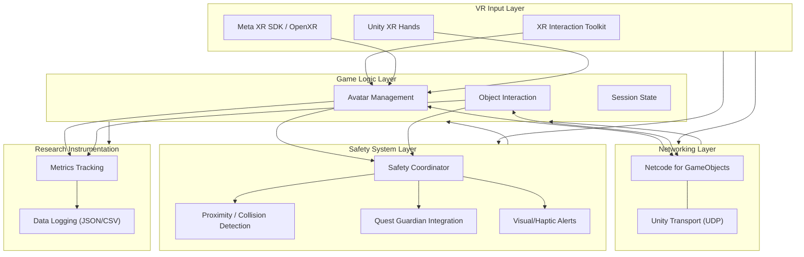

[← Documentation Home](../README.md) · [← Architecture](README.md)

# System Overview

This page provides layered architecture views and high-level relationships between major subsystems for the co-located multi-user VR system (3 users, Meta Quest 3).

## Layered Architecture (Requirements 1.3)

## Subsystem Overview
- VR Input Layer: Head/hand tracking, controller input via XR Interaction Toolkit and Meta XR/OpenXR.
- Networking Layer: Client-server model using Unity Netcode for GameObjects with Unity Transport.
- Safety System Layer: Independent collision prevention with Guardian integration and alerts.
- Game Logic Layer: Avatars, interactions, and session management.
- Research Layer: Metrics capture and local data logging for analysis.
