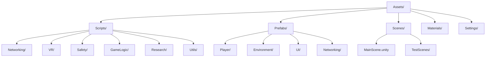
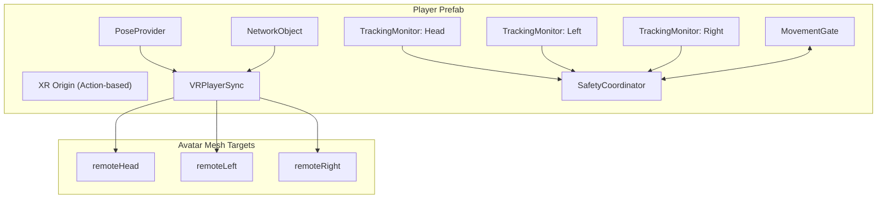
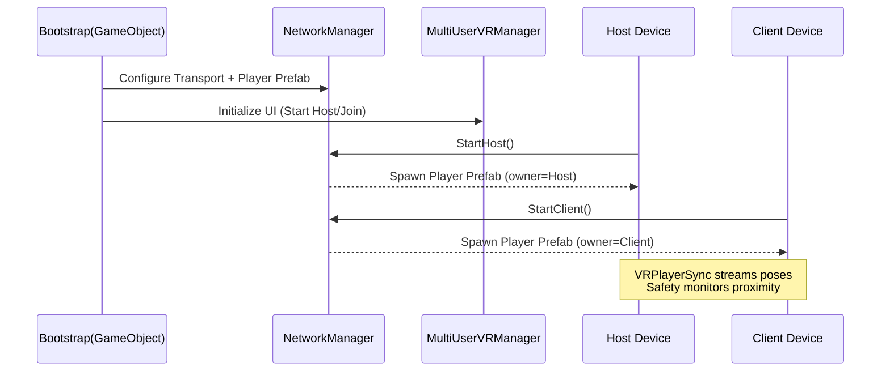

[← Documentation Home](../README.md) · [← Architecture](README.md)

# Unity Integration (Prefab · Scenes · Assets)

Unity-focused diagrams reflecting the established project conventions and planned structure (Req 1.4, 2.4). These support developer navigation and setup.

## Asset Organization (planned `vr/Assets/`)

Notes:
- Scripts namespaces follow `MultiUserVR.*` (Networking, VR.Input, Safety, GameLogic, Research, Utils)
- Player Prefab lives under `Prefabs/Player/`; networked props under `Prefabs/Networking/`

## Player Prefab Composition (XR Origin extended)

Key points:
- XR Origin provides local head/hand transforms to PoseProvider and VRPlayerSync
- NetworkObject enables NGO spawning/ownership; VRPlayerSync writes/reads pose data
- SafetyCoordinator subscribes to Proximity/Safety events and controls MovementGate

## Bootstrap & Spawn Flow (MainScene)

